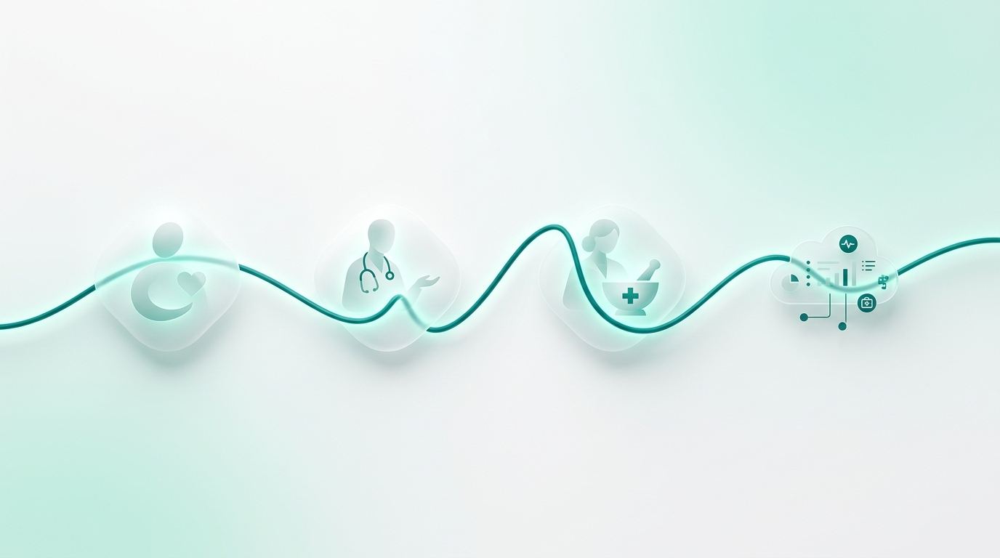
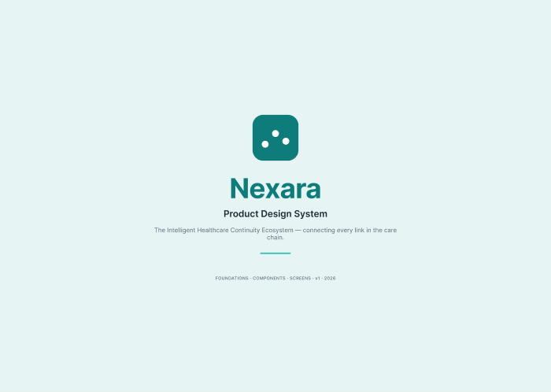
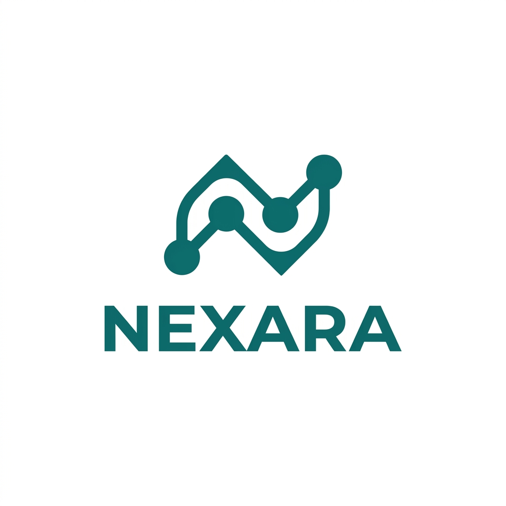
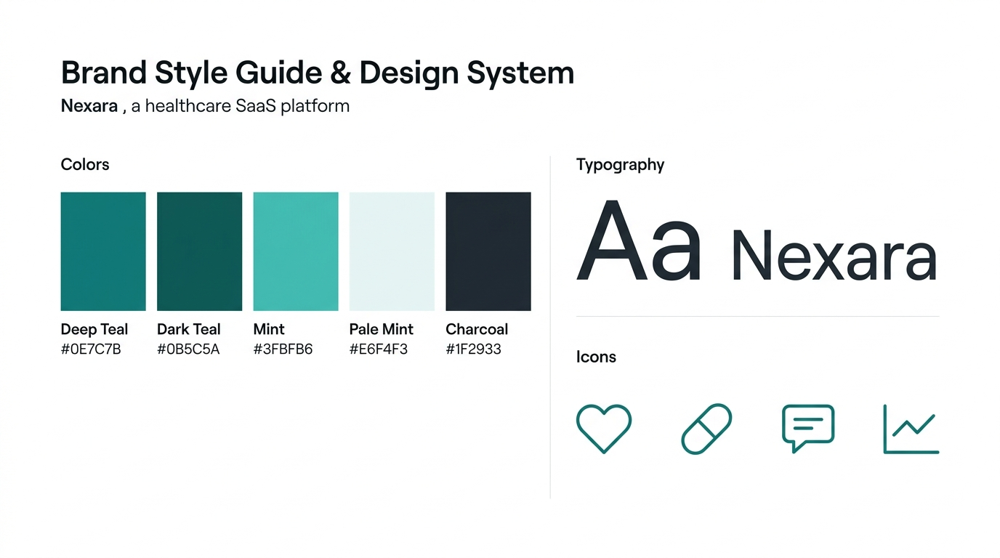
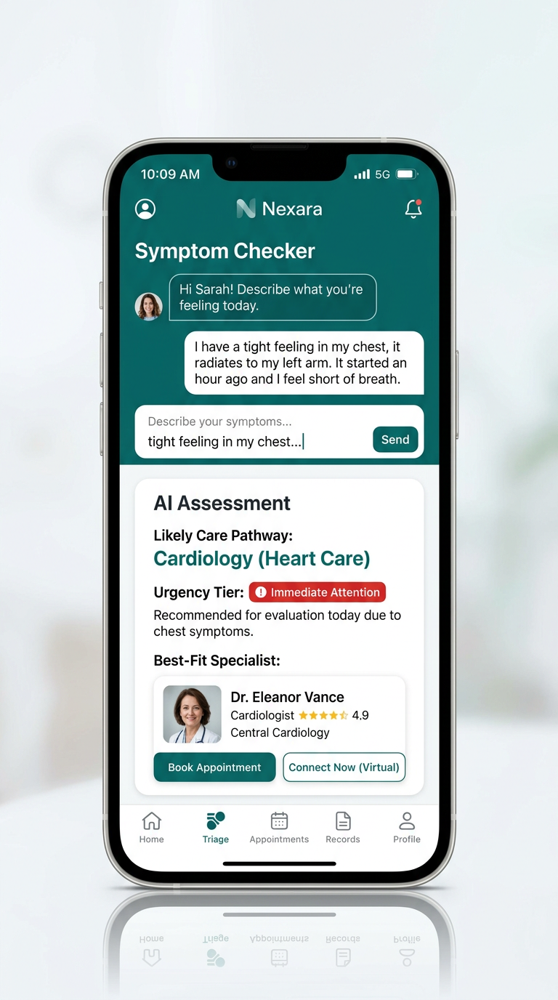
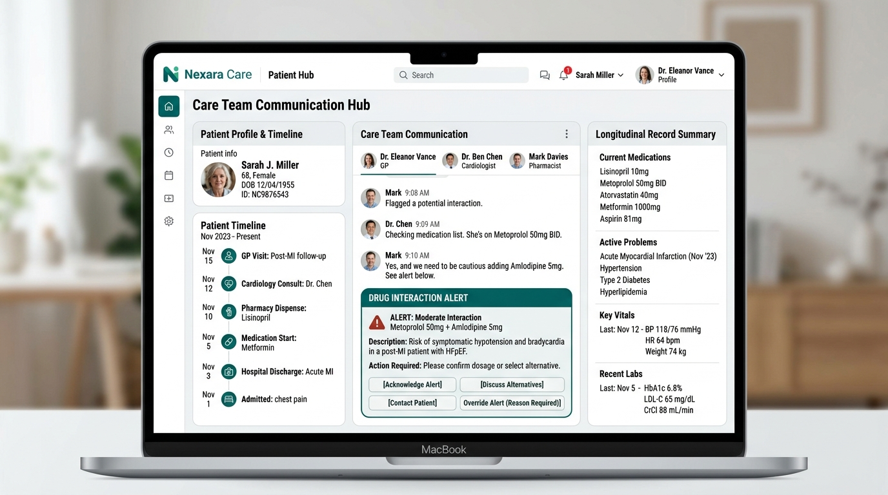
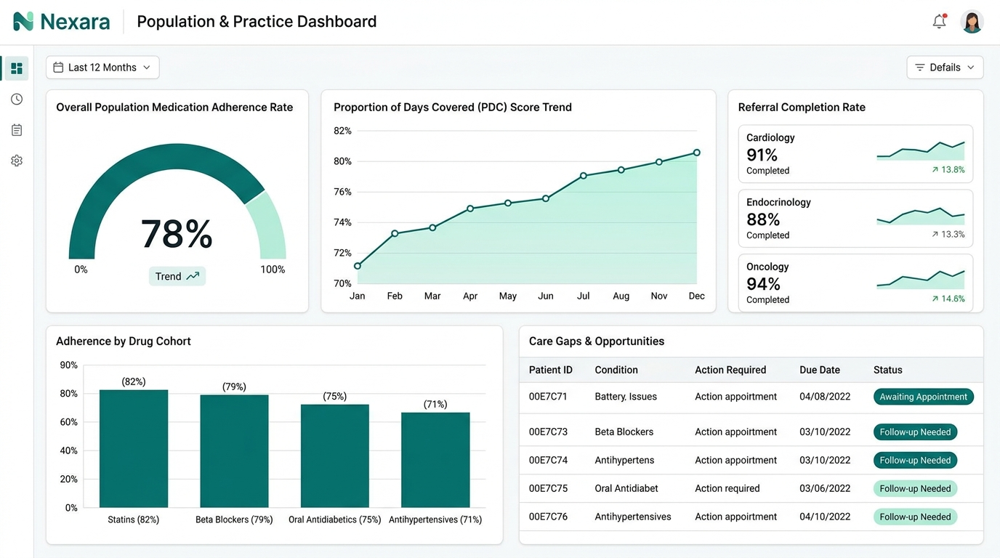

# Nexara — Product Design System

**The Intelligent Healthcare Continuity Ecosystem**
*Connecting every link in the care chain — from first symptom to long-term adherence.*

> Final product design document. Companion to the Series A pitch (`pitch_styled.pdf`).
> **Live Figma file:** https://www.figma.com/design/UQ3esejYL49sBwcI3gXXkN — *Nexara — Product Design System*
> **Code tokens:** [`tokens/nexara-tokens.css`](tokens/nexara-tokens.css) · [`tokens/tailwind.theme.js`](tokens/tailwind.theme.js)
> **Rendered design system:** [`preview/nexara-design-system.html`](preview/nexara-design-system.html) — open in a browser; foundations + all components + all 3 screens, live on the tokens.
> The Figma variables, the CSS, and the Tailwind theme are one source of truth — they are generated to match each other 1:1.

---

## 0. Build Status (Figma)

The design system was scaffolded directly in Figma via MCP. Current state of the file:

| Area | Status | Notes |
|---|---|---|
| **Color variables** | ✅ Live | `Nexara/Color` — 14 primitives → 18 semantic aliases, scoped + WEB code syntax (`var(--nx-…)`) |
| **Spacing/Radius variables** | ✅ Live | `Nexara/Spacing` — 8 spacing + 3 radius, scoped + code syntax |
| **Text styles** | ✅ Live | 9 Inter styles (Display/XL → Overline) |
| **Effect style** | ✅ Live | `Elevation/Card` |
| **Pages** | ✅ Live | Cover · Foundations · Components · Screens |
| **Cover page** | ✅ Built | Brand lockup, title, tagline (see proof below) |
| **Foundations · Color** | ✅ Built | Swatch grid bound to live variables |
| **Foundations · Type + Spacing** | ⏳ Pending | Spec below; not yet drawn |
| **Components page** | ⏳ Pending | Specs below (Button, Status Badge, KPI Card, Input) |
| **Screens page** | ⏳ Pending | Specs below (Patient Triage, Care Hub, Payer Dashboard) |

**Figma blocker:** the original account (`imrannawaz.dawood@kgen.io`) holds a **View seat** (6 MCP
calls/month — now spent). The account later swapped to the local `figma-developer-mcp` (Framelink), but
that is a **personal-access-token / REST** integration: read-only for canvas content (it can extract
frames/images and post comments, but the Figma REST API has **no endpoints to create frames, components,
or variables** — design creation only exists in the Plugin API). So the in-Figma Components/Screens build
needs the **`claude.ai Figma` OAuth connector** reconnected on a **Full/Dev** seat.

**Resolution:** the Components and Screens are delivered as a fully **rendered HTML/CSS design system**
([`preview/nexara-design-system.html`](preview/nexara-design-system.html)) wired to the same tokens — a
browser-viewable, pixel-accurate spec ready to port into Figma when the OAuth connector is back. The
build-ready specs below mirror it.

---

## 1. Product Vision

Nexara is the **connective tissue** of healthcare — not a symptom checker, not a booking tool, not an
adherence app, but the layer that makes all of them work together. Structurally it is **one longitudinal
patient record with four intelligent layers acting on it**:

1. **Routing layer** — gets the patient to the right door (AI Triage).
2. **Matching layer** — books the right professional (Smart Provider Matching).
3. **Coordination layer** — keeps the care team in sync (Care Team Hub).
4. **Retention layer** — diagnoses *why* care breaks down and fixes it (Root Cause Engine).

Everything writes back to the **Golden Thread** — the single living narrative that makes every subsequent
encounter smarter than the last. Defensibility is not any one screen; it is the *compounding* of these four
data streams against one record.

**Positioning guardrails:** not a diagnosis engine (decision support, human-in-the-loop) · not a walled
garden (FHIR-native, EHR-embedded) · not patient-billed (free at point of use; five B2B buyers pay).

---

## 2. Personas → Surfaces

One ecosystem, four surfaces from a shared data spine.

| Persona | Job-to-be-done | Surface | "Good" feels like |
|---|---|---|---|
| **Patient** | Get me to the right care without becoming my own navigator. | Mobile app | Calm, guided, never repeats history. |
| **Provider** | Tell me why this patient is here, with full context, before they sit down. | Care Team Hub (web, EHR-embedded) | Context-first, low-click, in-workflow. |
| **Pharmacist** | Surface the interaction + adherence barrier so I act in one call. | Console + structured alerts | Actionable, structured, one-click. |
| **Payer / admin** | Show adherence, referral completion, Star-rating impact. | Population Dashboard | Dense but readable BI; outcomes in dollars. |

**Design implication:** the shared component library must scale from consumer-grade mobile (warmth, large
targets, plain language) to enterprise BI (density, scannable data, audit trails) without losing coherence.
The teal/whitespace system is chosen because it reads as both *reassuring* (patient) and *credible* (clinician/payer).

---

## 3. Brand Identity

### 3.1 Logo

An abstract **connected-node "N"** — a continuous line linking discrete points: separate participants
(patient, GP, specialist, pharmacist) joined into one continuous thread; nodes double as data points.

- Min clear space = one node height on all sides. No gradients/shadows on the mark.
- Monochrome white on teal/charcoal; deep-teal mark on white/pale-mint.
- Wordmark may stand alone in dense UI; emblem alone for app icon/favicon.

### 3.2 Color & Type

> Authoritative values live in [`tokens/nexara-tokens.css`](tokens/nexara-tokens.css) and the Figma
> `Nexara/Color` collection. Summary:

| Token | Hex | Role |
|---|---|---|
| `--nx-teal-700` / `bg-brand` / `action-primary` | `#0E7C7B` | Primary brand & actions |
| `--nx-teal-900` / `action-primary-hover` | `#0B5C5A` | Hover/pressed, headings, depth |
| `--nx-mint-500` / `accent-mint` | `#3FBFB6` | Secondary accent, positive trends |
| `--nx-mint-50` / `bg-brand-subtle` | `#E6F4F3` | Surfaces, selected rows, info panels |
| `--nx-charcoal-900` / `text-primary` | `#1F2933` | Primary text |
| `--nx-slate-500` / `text-secondary` | `#5B6B79` | Secondary text, labels |
| `--nx-gray-200` / `border-default` | `#E2E8ED` | Borders, dividers |

**Status colors** (kept distinct from brand teal so clinical signals never blur into chrome):
`success #1E9E6A` · `warning #E0A100` · `danger #D64545` · `info #2D7FF0`.

> **Accessibility:** target WCAG AA (4.5:1 body, 3:1 large/UI). Body uses `text-primary` on light surfaces.
> Status colors are **always** paired with icon + label — never color alone (color-blind safety = clinical-error safety).

**Type scale (Inter):** Display/XL 48 · Heading L/M/S 32/24/18 · Body L/M 16/14 · Label/M 14 · Caption 12 · Overline 11. Line-height 1.5 body / ~1.2 headings.

### 3.3 Voice & tone
- **Patient:** plain, warm, reassuring, jargon-free; never alarmist (deliberately avoids the "anxiety-inducing search results" failure mode).
- **Clinician:** terse, factual, context-first — lead with *why this patient, why now*.
- **Payer:** outcome- and dollar-anchored — PDC, Star Ratings, readmissions, completion rates.

---

## 4. Component Specs (build-ready)

All components bind to the live Figma variables — **no hardcoded fills/spacing/radius**.

### 4.1 Button  `Component: Button`
- **Variant axes:** `Style = Primary | Secondary | Ghost` × `Size = Sm | Md` × `State = Default | Hover | Disabled`.
- **Primary:** fill `action/primary`, text `text/on-brand`; hover → `action/primary-hover`; disabled → 40% opacity.
- **Secondary:** fill `bg/base`, 1px `border/strong`, text `text/brand`.
- **Ghost:** transparent fill, text `text/brand`.
- Radius `radius/sm`; padding Md = `space/12` × `space/16`, Sm = `space/8` × `space/12`; label `Label/M`; auto-layout HUG, icon slot via INSTANCE_SWAP.

### 4.2 Status Badge  `Component: StatusBadge`
- **Variant axis:** `Tone = Success | Warning | Danger | Info`.
- Fill = matching `status/*` at 12% over `bg/base`; text + dot = full `status/*`; radius `radius/pill`; padding `space/4` × `space/12`; `Caption` text; **always icon/dot + label**.
- Used for urgency tier, adherence state, referral status.

### 4.3 KPI Card  `Component: KpiCard`
- Frame: fill `bg/base`, 1px `border/default`, radius `radius/md`, `Elevation/Card`, padding `space/24`, vertical auto-layout gap `space/8`.
- Slots: Overline label (`text/secondary`), big value (`Heading/L`, `text/primary`), delta StatusBadge.

### 4.4 Input  `Component: Input`
- **Variant axis:** `State = Default | Focus | Error`.
- Fill `bg/base`, 1px `border/strong` (Focus → `action/primary` 2px; Error → `status/danger`), radius `radius/sm`, padding `space/12` × `space/16`, `Body/M`; label `Label/M` above, helper/error `Caption` below.

---

## 5. Screen Specs (build-ready)

Reference renders in `assets/`; build natively from components + tokens on the Screens page.

### 5.1 Patient App — AI Triage / Intake

- 390×844 mobile frame, `bg/base`. Header with Nexara wordmark.
- NL symptom chat field (Input) → **AI Assessment** KpiCard-style card: *Likely care pathway*, urgency-tier StatusBadge, *Best-fit specialist* row, two Buttons (Primary "Book", Secondary "Connect now").
- Persistent "guidance, not diagnosis" caption. One primary decision per screen; large targets; calm spacing.

### 5.2 Care Team Communication Hub

- 1440×1024 web frame, EHR-embedded feel. Three columns:
  - **Left:** patient timeline (Golden Thread items).
  - **Center:** GP / specialist / pharmacist thread with a structured **drug-interaction alert** card + one-click response Buttons.
  - **Right:** record summary (meds, allergies, recent triage, adherence StatusBadge).
- Quiet audit affordance (auditability is a feature).

### 5.3 Population & Practice Dashboard

- 1440×1024 web frame. Top row of KpiCards (adherence rate, PDC, referral completion); PDC trend line; adherence-by-cohort bars; care-gap table.
- RPM billing export (CPT 99453–99458). Dense but governed by the same whitespace + teal accenting.

---

## 6. Design System Foundations

- **Grid:** 8px base (4px half-step for dense data). Scale 4/8/12/16/24/32/48/64.
- **Radius:** 8 cards · 12 modals/sheets · 999 pills.
- **Elevation:** restrained; prefer `bg/brand-subtle` surfaces + hairline borders over heavy shadows.
- **Layout:** mobile single-column; web uses a 12-col grid with a left context rail.

### Cross-surface principles
1. **Context before action** — every screen answers "why am I seeing this?" first.
2. **The patient is never the messenger** — coordination happens between professionals in-product.
3. **Color carries meaning, never decoration** — brand teal = chrome/actions; status colors = clinical signal.
4. **Auditable by design** — sensitive views expose who-saw-what.
5. **Free-at-point-of-use feel** — the patient surface must never feel like enterprise software.

---

## 7. File & Asset Index

| Path | What |
|---|---|
| `DESIGN_DOC.md` | This document |
| Figma `UQ3esejYL49sBwcI3gXXkN` | Live design system (tokens, cover, color foundations) |
| `tokens/nexara-tokens.css` | CSS custom properties (matches Figma variables) |
| `tokens/tailwind.theme.js` | Tailwind theme extension |
| `preview/nexara-design-system.html` | **Rendered design system** — foundations, components, 3 screens |
| `preview/render.png` | Full-page screenshot proof of the rendered system |
| `assets/01-brand-hero.png` | Brand hero |
| `assets/02-logo.png` | Logo concept |
| `assets/03-style-tile.png` | Color + type style tile |
| `assets/04-app-triage.png` | Patient app — AI triage |
| `assets/05-care-hub.png` | Care Team Hub |
| `assets/06-payer-dashboard.png` | Population dashboard |
| `figma-proofs/cover.png` | Screenshot of the built Figma cover |

---

## 8. Next Steps (to finish the Figma build)

1. **Upgrade the Figma seat** to Full/Dev (or authenticate a Full/Dev account) — unblocks MCP writes.
2. **Resume build** — finish Foundations (type ramp + spacing bars), then Components page (Button → Badge → KpiCard → Input, each with variants + bound tokens), then Screens page (the three frames above).
3. **Vectorize the logo** — current mark is a raster concept; rebuild as SVG with the exact palette.
4. **Publish the library** — turn `Nexara/Color` + `Nexara/Spacing` + styles + components into a published Figma library for the product team.

> Generated visuals are *directional concepts* (Nano Banana, 1k); AI-rendered UI text is illustrative, not final copy. Treat them as mood/layout reference for high-fidelity design.
